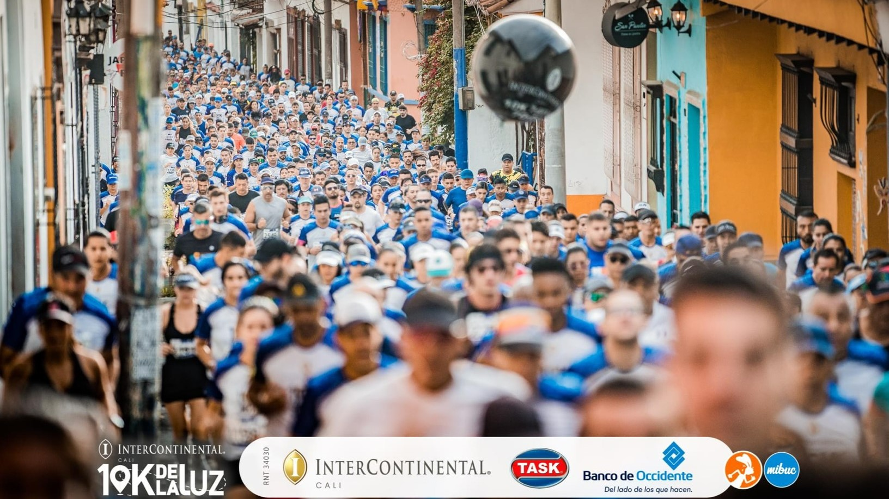

```{r setup, include=FALSE}
library(ggplot2)
library(flexdashboard)
# Install thematic and un-comment for themed static plots (i.e., ggplot2)
# thematic::thematic_rmd()
library(ggplot2)
library(paqueteMET)

data("CarreraLuz22")

Theme2 = theme(
  axis.title.x = element_text(size = 8),
  axis.text.x = element_text(size = 8),
  axis.title.y = element_text(size = 8),
  # axis.text.y = element_blank(),
  axis.text = element_text( size = 8),
  legend.title = element_text(size = 8),
  legend.text = element_text(size = 8),  
  strip.text = element_text(size=8),
  title =element_text(size=8, face='bold')
)# tamaño letra por grupos

# subsets-----------------------------------------------------------------------
CarreraLuz22$sex[CarreraLuz22$sex == "M"]="Hombre"
CarreraLuz22$sex[CarreraLuz22$sex == "F"]="Mujer"
#-------------------------------------------------------------------------------
CarreraLuz22M = subset(CarreraLuz22, CarreraLuz22$sex=="Hombre")
CarreraLuz22F = subset(CarreraLuz22, CarreraLuz22$sex=="Mujer")
#-------------------------------------------------------------------------------
CarreraLuz22_c1M = subset(CarreraLuz22M, CarreraLuz22M$categoria=="1. Juvenil")
CarreraLuz22_c2M = subset(CarreraLuz22M, CarreraLuz22M$categoria=="2. Abierta")
CarreraLuz22_c3M = subset(CarreraLuz22M, CarreraLuz22M$categoria=="3. Veteranos A")
CarreraLuz22_c4M = subset(CarreraLuz22M, CarreraLuz22M$categoria=="4. Veteranos B")
CarreraLuz22_c5M = subset(CarreraLuz22M, CarreraLuz22M$categoria=="5. Veteranos C")

CarreraLuz22_c1F = subset(CarreraLuz22F, CarreraLuz22F$categoria=="1. Juvenil")
CarreraLuz22_c2F = subset(CarreraLuz22F, CarreraLuz22F$categoria=="2. Abierta")
CarreraLuz22_c3F = subset(CarreraLuz22F, CarreraLuz22F$categoria=="3. Veteranos A")
CarreraLuz22_c4F = subset(CarreraLuz22F, CarreraLuz22F$categoria=="4. Veteranos B")
CarreraLuz22_c5F = subset(CarreraLuz22F, CarreraLuz22F$categoria=="5. Veteranos C")
#-------------------------------------------------------------------------------

categoria= c("Juvenil","Abierta","Veteranos A", "Veteranos B","Veteranos C")
t2 = aggregate(CarreraLuz22$timerun/60, by=list(CarreraLuz22$categoria,CarreraLuz22$sex), FUN= summary)
t2=t2$x
t2m=t2[1:5,]
t2m = round(t2m, 1)
row.names(t2m)=categoria
t2h=t2[6:10,]
t2h = round(t2h, 1)
row.names(t2h)=categoria

```

## Column {data-width="700"}

### **CARRERA LA LUZ 2022**

```{r, echo=FALSE, out.width="40%", fig.align='center'}



```
</br>
**Carera 10K de la Luz** Evento realizado el pasado 23 de octubre de 2022 en la ciudad de Cali, Colombia por la organización deportiva Juancho Correlón en cooperación con el Hotel Intercontinental con el propósito de brindar ayudas al programa "Compromiso Valle" por los emprendedores y las escuelas de iniciación deportiva de la ciudad, a través de lo recaudado con las inscripciones. Alrededor de casi 3.000 deportistas fueron participes del recorrido que partió desde el hotel Intercontinental para disfrutar de emblemáticos sitios y la belleza de la capital vallecaucana; sitios como **La Calle De La Escopeta, El Museo Arqueológico La Merced, El Bulevar Del Rio, El Puente Ortiz, La Gobernación Del Valle, El Edificio Aristi, La Plazoleta De San Francisco, La Librería Nacional O El Mueso La Tertulia** hicieron parte de los recorridos de 5 o 10 kilómetros hasta finalizar nuevamente en el hotel Intercontinental. [juanchocorrelon.com](https://juanchocorrelon.com/intercontinental-10k-luz-2022/#10k)

## Column {.tabset data-width="800"}

### **NUESTRAS CORREDORAS**

```{r, echo=FALSE, fig.height=5, fig.align='center'}

library(dplyr)
x <- CarreraLuz22F %>%
  group_by(categoria) %>%
  summarise(count = n())

colors <- c("#B695C0", "#967BB6", "#D6B6C0", "#B6A4C0", "#C0B6AF")
labels <- paste(x$categoria, x$count)
pie(x$count, col = colors, labels = labels, main = "Participación Por Categoría", clockwise = FALSE)

```

### **PARTICIPACIÓN POR EDADES**

```{r, echo=FALSE, fig.height=5, fig.align='center'}

hist(x = CarreraLuz22F$edad, main = "Participación por Edades",
     xlab = "Edad", ylab = "Cantidad",
     col = "#fe8863")

```


### **TIEMPOS POR CATEGORIA**

```{r, echo=FALSE, fig.height=3, fig.align='center'}

library(ggplot2)
ggplot(CarreraLuz22F, aes(x = categoria, y = timerun/60 )) +
  geom_boxplot(aes(fill = categoria)) + 
  labs(title = "", y= "Tiempo/Min", x= "Categorías Corredoras") +
  scale_fill_manual(values = c("#B695C0", "#967BB6", "#D6B6C0", "#B6A4C0", "#C0B6AF")) +
  theme(legend.position = "")

```
</br>
```{r, echo=FALSE, fig.height=3, fig.align='center'}

t2m

```


### **ALGUNAS ESTADÍSTICAS**

**PARTICIPACIÓN DE LAS MUJERES**

```{r, echo=FALSE}

paste0(round(length(CarreraLuz22F$id)/length(CarreraLuz22$id)*100, 1),"%")

```

**VELOCIDAD MÁXIMA MUJERES DE LA CATEGORÍA ABIERTA**

```{r, echo=FALSE}

paste0(round(10070/min(CarreraLuz22_c2F$timerun),2),"m/s")

```

**ESTADÍSTICAS DE TIEMPOS POR CATEGORÍA**

```{r, echo=FALSE}

library(dplyr)

GruposF <- group_by(CarreraLuz22F, categoria)

IndicadoresGrupoF <- GruposF %>%
  summarise_at(vars(timerun), funs(PROMEDIO = round(mean(.), 2),
                                   MEDIANA = round(median(.), 2),
                                   SD = round(sd(.), 2),
                                   RANGO = round(max(.)-min(.), 2)))

IndicadoresGrupoF

```


## Column {.tabset data-width="800"}

### **NUESTROS CORREDORES**


```{r, echo=FALSE, fig.height=5, fig.align='center'}

library(dplyr)
x <- CarreraLuz22M %>%
  group_by(categoria) %>%
  summarise(count = n())

colors <- c("#0F4C81", "#197ACF", "#3F6E97", "#5797CF", "#092F4F")
labels <- paste(x$categoria, x$count)
pie(x$count, col = colors, labels = labels, main = "Participación Por Categoría", clockwise = FALSE)

```

### **PARTICIPACIÓN POR EDADES**

```{r, echo=FALSE, fig.height=5, fig.align='center'}

hist(x = CarreraLuz22M$edad, main = "Participación por Edades",
     xlab = "Edad", ylab = "Cantidad",
     col = "#0F4C81")

```


### **TIEMPOS POR CATEGORIA**

```{r, echo=FALSE, fig.height=3, fig.align='center'}

library(ggplot2)
ggplot(CarreraLuz22M, aes(x = categoria, y = timerun/60 )) +
  geom_boxplot(aes(fill = categoria)) + 
  labs(title = "", y= "Tiempo/Min", x= "Categorías Corredores") +
  scale_fill_manual(values = c("#0F4C81", "#197ACF", "#3F6E97", "#5797CF", "#092F4F")) +
  theme(legend.position = "")

```
</br>
```{r, echo=FALSE, fig.height=3, fig.align='center'}

t2h

```

### **ALGUNAS ESTADÍSTICAS**

**PARTICIPACIÓN DE LAS HOMBRES**

```{r, echo=FALSE}

paste0(round(length(CarreraLuz22M$id)/length(CarreraLuz22$id)*100, 1),"%")

```

**VELOCIDAD MÁXIMA HOMBRES DE LA CATEGORÍA ABIERTA**

```{r, echo=FALSE}

paste0(round(10070/min(CarreraLuz22_c2M$timerun),2),"m/s")

```

**ESTADÍSTICAS DE TIEMPOS POR CATEGORÍA**

```{r, echo=FALSE}

library(dplyr)

GruposM <- group_by(CarreraLuz22M, categoria)

IndicadoresGrupoM <- GruposM %>%
  summarise_at(vars(timerun), funs(PROMEDIO = round(mean(.), 2),
                                   MEDIANA = round(median(.), 2),
                                   SD = round(sd(.), 2),
                                   RANGO = round(max(.)-min(.), 2)))

IndicadoresGrupoM

```


## Column {data-width="2"}

**PROMEDIO DE EDAD MUJERES**

### Juvenil {.value-box}

```{r}

valueBox(paste0(round(mean(CarreraLuz22_c1F$edad), 1), " años"),
         caption = "Categoría Juvenil", 
         color = "#B695C0")
```

### Abierta {.value-box}

```{r}

valueBox(paste0(round(mean(CarreraLuz22_c2F$edad), 1), " años"),
         caption = "Categoría Abierta", 
         color = "#967BB6")
```

### Veteranas A {.value-box}

```{r}

valueBox(paste0(round(mean(CarreraLuz22_c3F$edad), 1), " años"),
         caption = "Categoría Veteranas A", 
         color = "#D6B6C0")
```

### Veteranas B {.value-box}

```{r}

valueBox(paste0(round(mean(CarreraLuz22_c4F$edad), 1), " años"),
         caption = "Categoría Veteranas B", 
         color = "#B6A4C0")
```

### Veteranas C {.value-box}

```{r}

valueBox(paste0(round(mean(CarreraLuz22_c5F$edad), 1), " años"),
         caption = "Categoría Veteranas C", 
         color = "#C0B6AF")
```

## Column {data-width="2"}

**PROMEDIO DE EDAD HOMBRES**

### Juvenil {.value-box}

```{r}

valueBox(paste0(round(mean(CarreraLuz22_c1M$edad), 1), " años"),
         caption = "Categoría Juvenil", 
         color = "#0F4C81")
```

### Abierta {.value-box}

```{r}

valueBox(paste0(round(mean(CarreraLuz22_c2M$edad), 1), " años"),
         caption = "Categoría Abierta", 
         color = "#197ACF")
```

### Veteranos A {.value-box}

```{r}

valueBox(paste0(round(mean(CarreraLuz22_c3M$edad), 1), " años"),
         caption = "Categoría Veteranos A", 
         color = "#3F6E97")
```

### Veteranos B {.value-box}

```{r}

valueBox(paste0(round(mean(CarreraLuz22_c4M$edad), 1), " años"),
         caption = "Categoría Veteranos B", 
         color = "#5797CF")
```

### Veteranos C {.value-box}

```{r}

valueBox(paste0(round(mean(CarreraLuz22_c5M$edad), 1), " años"),
         caption = "Categoría Veteranos C", 
         color = "#092F4F")
```
